# Movie Ticket Booking System – Low Level Design (LLD)

---

## System Architecture & LLD Class Diagram

```mermaid
classDiagram

    %% ─── ENUMS ────────────────────────────────────────────────────────
    class SeatType {
        <<enumeration>>
        GOLD
        PLATINUM
    }

    class BookingStatus {
        <<enumeration>>
        PENDING
        CONFIRMED
        CANCELLED
    }

    class PaymentMode {
        <<enumeration>>
        CREDIT_CARD
        DEBIT_CARD
        UPI
        NET_BANKING
        WALLET
    }

    class PaymentStatus {
        <<enumeration>>
        PENDING
        SUCCESS
        FAILED
        REFUNDED
    }

    %% ─── MODELS ───────────────────────────────────────────────────────
    class City {
        - String cityId
        - String name
        - List~Theatre~ theatres
        - List~Movie~ movies
        + addTheatre(theatre)
        + addMovie(movie)
    }

    class Movie {
        - String movieId
        - String title
        - String language
        - int durationMinutes
    }

    class Theatre {
        - String theatreId
        - String name
        - City city
        - List~Show~ shows
        + addShow(show)
        + removeShow(show)
    }

    class Show {
        - String showId
        - Movie movie
        - Theatre theatre
        - LocalDateTime startTime
        - double basePrice
        - List~Seat~ seats
        - PricingStrategy pricingStrategy
        + getAvailableSeats() List~Seat~
        + setPricingStrategy(strategy)
    }

    class Seat {
        <<abstract>>
        - String seatId
        - String seatNumber
        - SeatType seatType
        - ReentrantLock lock
        - boolean isLocked
        - boolean isBooked
        + tryLock() boolean
        + releaseLock()
        + book()
        + release()
        + getPriceMultiplier() double
    }

    class GoldSeat {
        + getPriceMultiplier() double
    }

    class PlatinumSeat {
        + getPriceMultiplier() double
    }

    class Booking {
        - String bookingId
        - Show show
        - List~Seat~ seats
        - String userId
        - LocalDateTime bookingTime
        - double totalAmount
        - BookingStatus status
        - Payment payment
    }

    class Payment {
        - String paymentId
        - Booking booking
        - double amount
        - PaymentMode mode
        - PaymentStatus status
    }

    %% ─── STRATEGY INTERFACES ──────────────────────────────────────────
    class PricingStrategy {
        <<interface>>
        + calculatePrice(show, seat) double
    }

    class PaymentStrategy {
        <<interface>>
        + pay(amount, booking) boolean
        + getPaymentMode() PaymentMode
    }

    %% ─── PRICING IMPLEMENTATIONS ──────────────────────────────────────
    class SeatTypePricingStrategy {
        + calculatePrice(show, seat) double
    }

    %% ─── PAYMENT IMPLEMENTATIONS ──────────────────────────────────────
    class CardPaymentStrategy {
        + pay(amount, booking) boolean
        + getPaymentMode() PaymentMode
    }

    class UPIPaymentStrategy {
        + pay(amount, booking) boolean
        + getPaymentMode() PaymentMode
    }

    class NetBankingPaymentStrategy {
        + pay(amount, booking) boolean
        + getPaymentMode() PaymentMode
    }

    class WalletPaymentStrategy {
        + pay(amount, booking) boolean
        + getPaymentMode() PaymentMode
    }

    %% ─── SERVICES ─────────────────────────────────────────────────────
    class SearchService {
        + listMoviesInCity(city) List~Movie~
        + listTheatresInCity(city) List~Theatre~
        + getShowsForMovieInCity(movie, city) List~Show~
        + getShowsForTheatre(theatre) List~Show~
        + getAvailableSeatsForShow(show) List~Seat~
    }

    class BookingService {
        - BookingService instance$
        - Map bookings
        + getInstance()$ BookingService
        + createBooking(show, seats, userId, paymentStrategy) Booking
        + cancelBooking(bookingId) boolean
        + getBooking(bookingId) Booking
    }

    class AdminService {
        + addMovie(city, movie)
        + addTheatre(city, theatre)
        + addShow(theatre, show)
        + deleteShow(theatre, show)
        + addSeatToShow(show, seat)
        + updatePricingStrategy(show, strategy)
    }

    %% ─── INHERITANCE ──────────────────────────────────────────────────
    Seat <|-- GoldSeat
    Seat <|-- PlatinumSeat

    PricingStrategy <|.. SeatTypePricingStrategy
    PaymentStrategy <|.. CardPaymentStrategy
    PaymentStrategy <|.. UPIPaymentStrategy
    PaymentStrategy <|.. NetBankingPaymentStrategy
    PaymentStrategy <|.. WalletPaymentStrategy

    %% ─── COMPOSITION / ASSOCIATION ────────────────────────────────────
    City "1" *-- "many" Theatre
    City "1" *-- "many" Movie
    Theatre "1" *-- "many" Show
    Show "1" *-- "many" Seat
    Show --> PricingStrategy : uses
    Booking "1" *-- "1" Payment
    Booking --> Show
    Booking --> Seat

    BookingService ..> Booking : creates
    BookingService ..> PaymentStrategy : uses
    BookingService ..> PricingStrategy : uses via Show
    AdminService ..> City : mutates
    AdminService ..> Theatre : mutates
    AdminService ..> Show : mutates
    SearchService ..> City : reads
    SearchService ..> Show : reads
```

---

## Design Patterns

| Pattern | Where Applied | Why |
|---|---|---|
| **Strategy** | `PricingStrategy`, `PaymentStrategy` | Swap pricing / payment algorithms at runtime without changing callers |
| **Template Method** | `Seat` (abstract) | Defines the lock/book/release lifecycle skeleton; subclasses only provide `getPriceMultiplier()` |
| **Singleton** | `BookingService` | All booking transactions coordinate through one instance — essential for centralised concurrency control |

---

