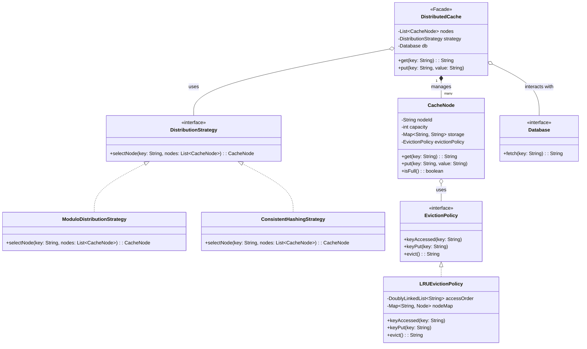

```mermaid
classDiagram
    class DistributedCache {
        <<Facade>>
        -List~CacheNode~ nodes
        -DistributionStrategy strategy
        -Database db
        +get(key: String): String
        +put(key: String, value: String)
    }

    class CacheNode {
        -String nodeId
        -int capacity
        -Map~String, String~ storage
        -EvictionPolicy evictionPolicy
        +get(key: String): String
        +put(key: String, value: String)
        +isFull(): boolean
    }

    class DistributionStrategy {
        <<interface>>
        +selectNode(key: String, nodes: List~CacheNode~): CacheNode
    }

    class ModuloDistributionStrategy {
        +selectNode(key: String, nodes: List~CacheNode~): CacheNode
    }

    class ConsistentHashingStrategy {
        +selectNode(key: String, nodes: List~CacheNode~): CacheNode
    }

    class EvictionPolicy {
        <<interface>>
        +keyAccessed(key: String)
        +keyPut(key: String)
        +evict(): String
    }

    class LRUEvictionPolicy {
        -DoublyLinkedList~String~ accessOrder
        -Map~String, Node~ nodeMap
        +keyAccessed(key: String)
        +keyPut(key: String)
        +evict(): String
    }

    class Database {
        <<interface>>
        +fetch(key: String): String
    }

    DistributedCache "1" *-- "many" CacheNode : manages
    DistributedCache o-- DistributionStrategy : uses
    DistributedCache o-- Database : interacts with
    CacheNode o-- EvictionPolicy : uses
    DistributionStrategy <|.. ModuloDistributionStrategy
    DistributionStrategy <|.. ConsistentHashingStrategy
    EvictionPolicy <|.. LRUEvictionPolicy
```
