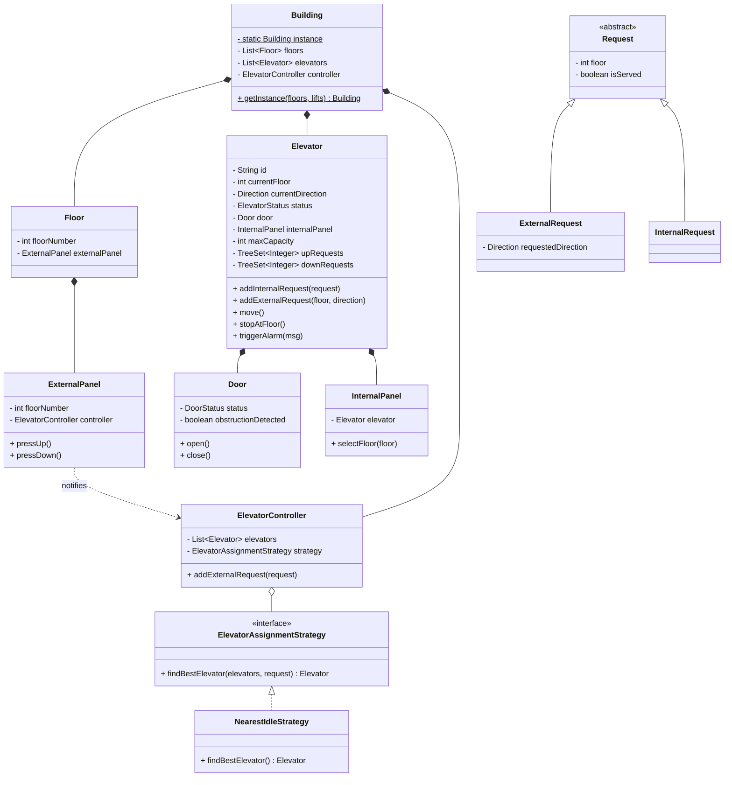

# Elevator System - Low Level Design (LLD)

## Design Overview (UML Diagram)

## Design Patterns Used

1. **Singleton Pattern**: The `Building` class ensures there's only one instance of the entire system structure.
2. **Strategy Pattern**: Used for `ElevatorAssignmentStrategy` to find the best lift for a call dynamically.

