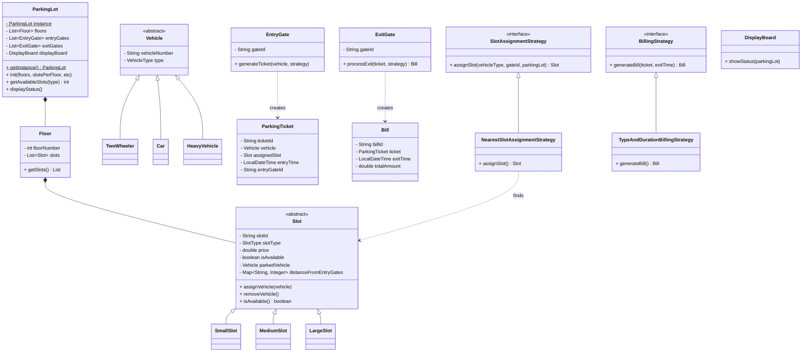

# Parking Lot System - Low Level Design (LLD)

**Design Patterns**:
- **Singleton**: The `ParkingLot` class holds unique instance-wide data.
- **Factory Method**: Vehicle and Slot object instantiation logic handles creation gracefully without bloating system configs.
- **Strategy Pattern**: Employed heavily for `SlotAssignmentStrategy` (calculating the nearest slot dynamically) and `BillingStrategy` (varying price factors depending on vehicle/duration).
- **Observer Pattern** (Hinted): `DisplayBoard` essentially acts as an observing module querying internal status across slots.
