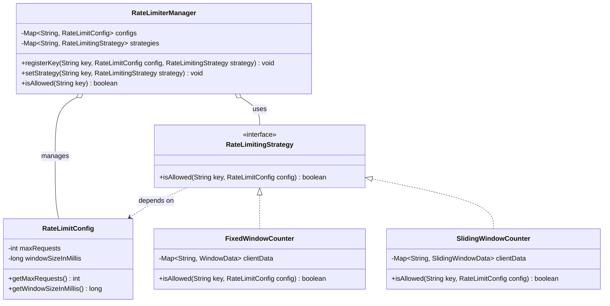

```mermaid
classDiagram
    class RateLimitConfig {
        -int maxRequests
        -long windowSizeInMillis
        +getMaxRequests() int
        +getWindowSizeInMillis() long
    }

    class RateLimitingStrategy {
        <<interface>>
        +isAllowed(String key, RateLimitConfig config) boolean
    }

    class FixedWindowCounter {
        -Map~String, WindowData~ clientData
        +isAllowed(String key, RateLimitConfig config) boolean
    }

    class SlidingWindowCounter {
        -Map~String, SlidingWindowData~ clientData
        +isAllowed(String key, RateLimitConfig config) boolean
    }

    class RateLimiterManager {
        -Map~String, RateLimitConfig~ configs
        -Map~String, RateLimitingStrategy~ strategies
        +registerKey(String key, RateLimitConfig config, RateLimitingStrategy strategy) void
        +setStrategy(String key, RateLimitingStrategy strategy) void
        +isAllowed(String key) boolean
    }

    RateLimitingStrategy <|.. FixedWindowCounter
    RateLimitingStrategy <|.. SlidingWindowCounter
    RateLimiterManager o-- RateLimitConfig : manages
    RateLimiterManager o-- RateLimitingStrategy : uses
    RateLimitingStrategy ..> RateLimitConfig : depends on
```
