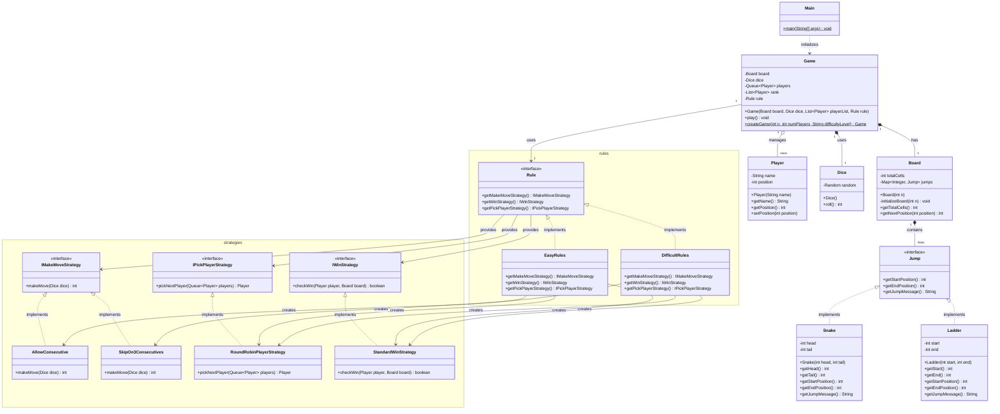

# Snake and Ladder
A Low-Level Design and Implementation of the classic Snake and Ladder game in Java.

## Class Diagram

```mermaid
classDiagram
    direction TB

    class Player {
        -String name
        -int position
        +Player(String name)
        +getName() String
        +getPosition() int
        +setPosition(int position)
    }

    class Dice {
        -Random random
        +Dice()
        +roll() int
    }

    class Jump {
        <<interface>>
        +getStartPosition() int
        +getEndPosition() int
        +getJumpMessage() String
    }

    class Snake {
        -int head
        -int tail
        +Snake(int head, int tail)
        +getHead() int
        +getTail() int
        +getStartPosition() int
        +getEndPosition() int
        +getJumpMessage() String
    }

    class Ladder {
        -int start
        -int end
        +Ladder(int start, int end)
        +getStart() int
        +getEnd() int
        +getStartPosition() int
        +getEndPosition() int
        +getJumpMessage() String
    }

    class Board {
        -int totalCells
        -Map~Integer, Jump~ jumps
        +Board(int n)
        -initializeBoard(int n) void
        +getTotalCells() int
        +getNextPosition(int position) int
    }

    class Game {
        -Board board
        -Dice dice
        -Queue~Player~ players
        -List~Player~ rank
        -Rule rule
        +Game(Board board, Dice dice, List~Player~ playerList, Rule rule)
        +play() void
        +createGame(int n, int numPlayers, String difficultyLevel)$ Game
    }

    class Main {
        +main(String[] args)$ void
    }

    namespace rules {
        class Rule {
            <<interface>>
            +getMakeMoveStrategy() IMakeMoveStrategy
            +getWinStrategy() IWinStrategy
            +getPickPlayerStrategy() IPickPlayerStrategy
        }
        class EasyRules {
            +getMakeMoveStrategy() IMakeMoveStrategy
            +getWinStrategy() IWinStrategy
            +getPickPlayerStrategy() IPickPlayerStrategy
        }
        class DifficultRules {
            +getMakeMoveStrategy() IMakeMoveStrategy
            +getWinStrategy() IWinStrategy
            +getPickPlayerStrategy() IPickPlayerStrategy
        }
    }

    namespace strategies {
        class IMakeMoveStrategy {
            <<interface>>
            +makeMove(Dice dice) int
        }
        class IPickPlayerStrategy {
            <<interface>>
            +pickNextPlayer(Queue~Player~ players) Player
        }
        class IWinStrategy {
            <<interface>>
            +checkWin(Player player, Board board) boolean
        }
        class AllowConsecutive {
            +makeMove(Dice dice) int
        }
        class SkipOn3Consecutives {
            +makeMove(Dice dice) int
        }
        class RoundRobinPlayerStrategy {
            +pickNextPlayer(Queue~Player~ players) Player
        }
        class StandardWinStrategy {
            +checkWin(Player player, Board board) boolean
        }
    }

    Jump <|.. Snake : implements
    Jump <|.. Ladder : implements

    Board "1" *-- "many" Jump : contains
    Game "1" *-- "1" Board : has
    Game "1" *-- "1" Dice : uses
    Game "1" o-- "many" Player : manages
    Game "1" --> "1" Rule : uses
    Main ..> Game : initializes

    Rule <|.. EasyRules : implements
    Rule <|.. DifficultRules : implements

    IMakeMoveStrategy <|.. AllowConsecutive : implements
    IMakeMoveStrategy <|.. SkipOn3Consecutives : implements
    IPickPlayerStrategy <|.. RoundRobinPlayerStrategy : implements
    IWinStrategy <|.. StandardWinStrategy : implements

    EasyRules --> AllowConsecutive : creates
    EasyRules --> RoundRobinPlayerStrategy : creates
    EasyRules --> StandardWinStrategy : creates
    DifficultRules --> SkipOn3Consecutives : creates
    DifficultRules --> RoundRobinPlayerStrategy : creates
    DifficultRules --> StandardWinStrategy : creates

    Rule --> IMakeMoveStrategy : provides
    Rule --> IPickPlayerStrategy : provides
    Rule --> IWinStrategy : provides
```
